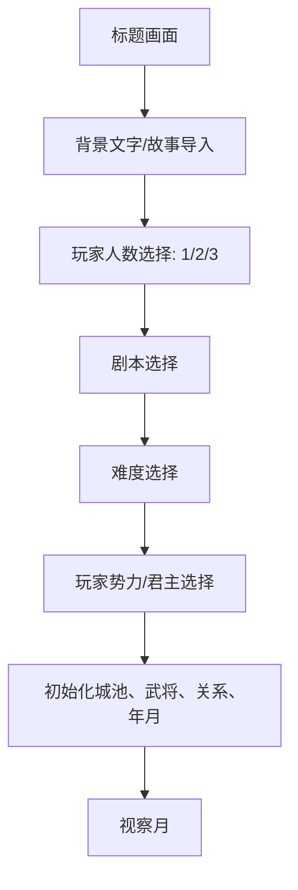
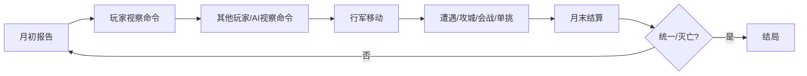
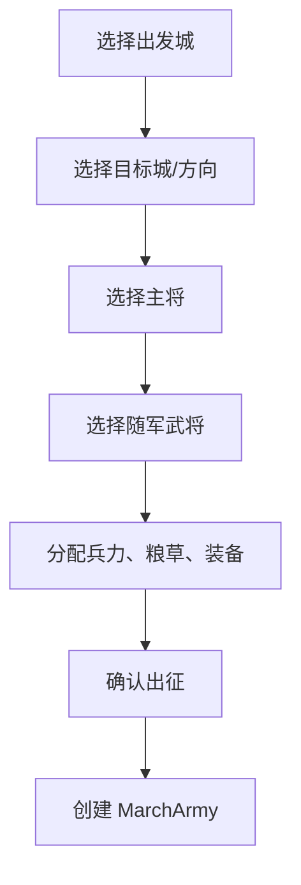
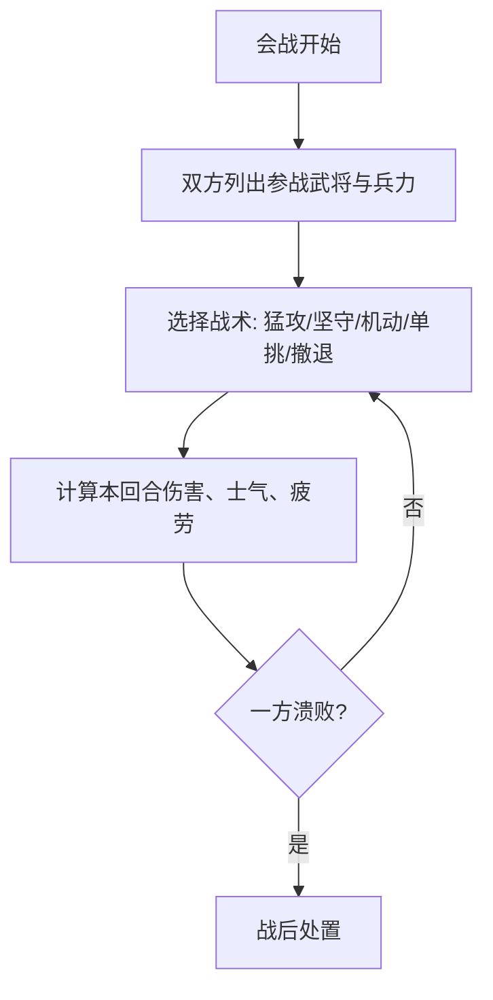

# 《乱世群英》玩法复刻产品文档

最后更新：2026-05-17  
调研对象：在线版本 `https://zaixianwan.app/zh-Hans/games/2668`、公开资料、当前 v2 项目实现  
用途：指导《烽火群英》复刻原作玩法结构与交互节奏。本文只沉淀可实现的规则、流程和系统关系，不复用原作 ROM、画面素材、音乐、文本脚本或商业资源。

## 1. 复刻目标

目标不是逐像素搬运原作，而是复刻它最有辨识度的产品结构：

- 以中国全境大地图为核心的回合制君主经营。
- 每月分成「视察/命令」与「行军/战斗」两个节奏层。
- 指令由内政、外交、军事三类展开，子命令数量固定且语义清晰。
- 出征后不是立即结算，而是在大地图上以军队对象移动、改道、撤退、攻城。
- 城池攻防由围城、强攻、火计、挑战、会战等战术入口组成。
- 单挑是独立的动作化对决，用武将能力和玩家操作共同决定结果。
- 多玩家最多 3 人可轮流控制不同势力；单人时其他势力由 AI 管理。

## 2. 调研结论分级

### 已实机观察确认

- 标题后进入玩家人数选择，可选 1/2/3 PLAY。
- 开局前有剧情/背景文字滚动，可按键推进。
- 游戏主体以「视察情況面」和「行軍面」为主要循环。
- MD 操作以 A/B/C 为主：在线站点键盘映射中 C=键盘 `z` 为确认，B=键盘 `x` 为返回，A=键盘 `s` 为辅助/情报功能；方向键移动，Start=Enter，Select=`v`。
- 开局设置按「方案 → 難度 → 動畫片 → 表示速度 → 君主」依次激活；方向键改当前栏选项，C/`z` 确认并进入下一栏。
- 开局后进入「部署」地图提示，随后进入「视察情況」月度地图。
- 视察地图中，在城池上按 C/`z` 打开/关闭城池详情；详情包含年月、城池编号/城名、君主、太守、金、借债、米、民、产值。
- 视察地图中按 A/`s` 打开全局情报总览。实机已确认 A/`s` 会在多个统计页之间切换，至少见到「产值」「武将数」「统治力」「税率」四类；B/`x` 返回地图。
- 方向移动到空地上按 C/`z` 会出现右侧纵向武将列表，列表内容为当前可操作城池/势力的武将。实机观察到曹操方濮阳列表包含：曹操、夏侯渊、夏侯惇、曹洪、曹仁。
- 武将列表中用上下方向键移动高亮，C/`z` 可打开所选武将详情卡。详情卡显示头像、姓名、等级/水平、官职、文官级、武官级、体力、武力、智力、德育、忠诚度、率兵力、机动力、兵力、士气、攻击力、武器。
- 在线站点公开说明与页面介绍确认：游戏有三个剧本、多个难度、多位指挥官/君主、最多三名玩家。
- 页面说明确认：将领战斗可进入侧面视角的一对一单挑。

### 资料交叉确认

- 视察面包含三大指令：内政、外交、军事。
- 内政 8 项：開發、調動、情報、福利、任命、税率、教育、運輸。
- 外交 7 项：同盟、離間、暗殺、火計、情報、借款、還款。其中離間/暗殺/火計属于计策类。
- 军事 6 项基础指令加出征流程：徵兵、武器、情報、人材、防衛、訓練、出征。
- 行军面可选择出征武将/军队，设定路线，在地图上移动或攻击他国城池。

### 待二次实机验证

- 每月行动点、武将行动消耗、金粮消耗的精确数值。
- 空地武将列表进入武将卡后，是否还存在二次确认进入命令菜单、以及具体按键条件。
- 单挑完整指令表、招式克制关系、体力/气力恢复规则。
- 攻城中强攻、围城、火计、挑战、会战的精确触发条件。
- AI 的优先级、外交成功率、借款/还款期限与利息。
- 多玩家回合顺序和同月内冲突处理。

## 3. 开局流程

### 3.1 主流程



### 3.2 开局配置

- 玩家人数：1、2、3。多人为本地轮流制，每名玩家绑定一个不同势力。
- 剧本：至少 3 个历史时间点。当前项目可保留 `189/200/215` 三档，但数据与事件描述必须原创化。
- 难度：建议保留 easy/normal/hard，影响 AI 侵略性、初始资源、计策成功率、自然灾害频率。
- 势力选择：展示君主名、势力颜色、首都、控制城池数、武将数、初始金粮兵、防御倾向。
- 原作开局设置的实际栏目顺序为：方案、难度、动画片、表示速度、君主。每栏用方向键选择，用 C/`z` 锁定进入下一栏。

## 4. 核心循环

游戏每月循环一次。推荐实现为奇数月视察、偶数月行军，或用同一个月内的两个阶段表达：



### 4.1 月初报告

月初必须让玩家理解局势变化：

- 年月、天气、灾害、收成。
- 金钱、粮草、人口、治安、兵力变化。
- 外交关系变化、同盟到期、借款到期。
- 敌军出征、城池被攻、武将受伤/俘虏/投降。

### 4.2 视察月

视察月是经营层。玩家先选城池，再选择内政/外交/军事，再执行子命令。

交互要求：

- 只能对己方城池执行大多数内政/军事命令。
- 情报类命令允许查看己方详细资料或侦察相邻/目标敌方资料。
- 每次执行后立即显示结果弹窗，突出资源变化。
- 命令失败不应无声吞掉，必须给出失败原因：金钱不足、武将不足、目标非法、关系不满足等。
- 城池详情不是主菜单：光标停在城池上按 C/`z` 应显示该城基础情报；光标在空地上按 C/`z` 才进入月度菜单。
- A/`s` 是快速总览入口。原作不是单一榜单，而是一组可轮换的全局统计页；当前实机已确认至少包含产值、武将数、统治力、税率四类。

### 4.2.1 视察面实机交互记录

当前确认的视察面不是“先点城池再弹三大类命令”的现代菜单结构，而是更接近手柄游标式操作：

1. 地图光标默认落在己方城市附近，可用方向键在地图上移动。
2. 光标压在城市节点上按 C/`z`，进入城市详情页；B/`x` 返回地图。
3. 光标移动到空地上按 C/`z`，右侧弹出当前城池/势力可操作武将列表。
4. 武将列表用上下方向键选择武将。已观察曹操方濮阳初始列表为曹操、夏侯渊、夏侯惇、曹洪、曹仁。
5. 在武将列表上按 C/`z`，进入所选武将详情卡；该卡不是战斗画面，而是执行命令前的信息确认层。
6. 武将详情卡字段应按原作的信息密度复刻：头像、姓名、等级/水平、官职、文官级、武官级、体力、武力、智力、德育、忠诚度、率兵力、机动力、兵力、士气、攻击力、武器。
7. A/`s` 打开的情报页遵循固定手柄逻辑：A/`s` 切换统计类别，方向键在下方城市列表中移动，C/`z` 可进入当前城市详情，B/`x` 返回地图。

产品复刻建议：月度命令应保留“先选可行动武将，再执行指令”的感觉。即使现代化 UI 增加快捷入口，也不要把武将选择隐藏在命令表单深处，因为原作的策略节奏明显建立在“谁来办这件事”的前置判断上。

### 4.3 行军月

行军月是战略机动层。视察月创建的军队在此移动与接敌。

交互要求：

- 军队以独立对象显示在地图上，和城池驻军分离。
- 每支军队包含主将、随军武将、兵力、粮草、士气、疲劳、目的地、路线。
- 玩家可选择军队，执行：设定目的地、行军、撤退、驻扎、结束。
- 军队按路线节点移动，不应瞬移到终点。
- 到达己方城池可驻扎/合流；到达敌城进入攻城；途中可触发道路事件。

## 5. 地图与城池

### 5.1 地图

- 中国全境大地图是第一信息层，不使用小地图作为主视图。
- 城池用据点节点表示，节点间用道路连接。
- 道路可带特性：村落、粮道、关隘、渡口。
- 地图显示模式至少包含：完整、紧凑、势力着色。

### 5.2 城池属性

建议城池模型：

| 字段 | 含义 | 影响 |
|---|---|---|
| owner | 所属势力 | 可执行命令、胜负判定 |
| gold | 金钱 | 内政、外交、军事开销 |
| food | 粮草 | 出征、行军、围城消耗 |
| troops | 驻军 | 防守和出征基础 |
| defense | 城防 | 攻城难度 |
| population | 人口 | 征兵上限、税收 |
| land | 土地 | 粮食收入 |
| commerce | 商业 | 金钱收入 |
| irrigation | 水利 | 收成稳定性 |
| publicOrder | 治安 | 税收、叛乱、征兵效率 |
| disaster | 灾害风险 | 月末随机事件 |
| garrisonCommanderId | 太守 | 内政效率、防守加成 |

### 5.3 武将属性

建议武将模型：

| 字段 | 含义 | 影响 |
|---|---|---|
| war | 武力 | 单挑、突击、近战伤害 |
| command | 统率 | 部队战力、士气保持、行军效率 |
| intel | 知力 | 情报、计策、火计、反计 |
| gov | 政治 | 开发、税收、福利、运输 |
| charm | 魅力 | 征兵、登用、忠诚、外交 |
| loyalty | 忠诚 | 被离间/登用风险 |
| troops | 个人带兵 | 出征编成 |
| weapons/training | 装备/训练 | 会战有效战力 |
| status | 状态 | 正常、负伤、俘虏 |
| fatigue | 疲劳 | 行军、战斗、命令效果 |

实机详情卡还暴露出以下原作字段，需要在复刻数据模型中保留或映射：

| 原作字段 | 建议字段 | 说明 |
|---|---|---|
| 水平 | level | 武将成长等级，影响文官级/武官级或综合能力 |
| 官职 | office | 任命/爵位/职务状态，可能为空 |
| 文官级 | civilRank | 文官等级，影响内政、外交、计策效率 |
| 武官级 | martialRank | 武官等级，影响带兵、攻击、训练与战斗表现 |
| 德育 | virtue | 原作显示字段，建议映射为德望/声望类属性，影响忠诚、招募、外交或民心 |
| 率兵力 | commandCapacity | 可有效统率的兵力上限或带兵能力 |
| 机动力 | mobility | 行军、追击、撤退或战场行动顺序 |
| 士气 | morale | 会战、攻城、撤退和溃败判定 |
| 攻击力 | attack | 由武力、兵力、武器、训练综合得到的显示战力 |
| 武器 | weapon | 武将/军队装备名称，不应只作为城市防御数值 |

## 6. 内政命令

内政命令应采用 8 宫格或接近原作的紧凑菜单。命令语义如下：

| 命令 | 目标 | 成本 | 主要效果 | 失败条件 |
|---|---|---|---|---|
| 開發 | 己方城池 | 金钱、武将行动 | 提升土地/水利，增加后续粮收 | 金钱不足、无可用文官 |
| 調動 | 己方相邻城池 | 少量金粮 | 调动武将/兵力/物资至相邻己城 | 无相邻己城、道路受阻 |
| 情報 | 城池/周边 | 金钱 | 查看城池、武将、邻接敌情 | 情报等级不足时只显示粗略值 |
| 福利 | 己方城池 | 金钱/粮草 | 提升治安、人口、民心 | 资源不足 |
| 任命 | 己方城池/武将 | 低成本 | 任命太守/军师/先锋，提升忠诚或职责加成 | 无可任命武将 |
| 税率 | 己方城池或全国 | 无 | 设置薄税/普通/重税，影响收入与治安 | 无 |
| 教育 | 武将 | 金钱、行动 | 提升知力/政治/经验，可能提升忠诚 | 无目标武将 |
| 運輸 | 相邻己城或出征军 | 金粮/兵力 | 运输金钱、粮草、兵力 | 目标不连通、物资不足 |

### 6.1 税率规则建议

- 薄税：金钱收入低，治安/人口恢复高。
- 普通：收入与治安中性。
- 重税：金钱收入高，治安下降，叛乱风险上升。
- 税率应是持久状态，而不是一次性循环按钮。

### 6.2 调动与运输区别

- 調動：重点是人和兵的部署，适合调武将、换太守、转移驻军。
- 運輸：重点是金钱/粮草/补给，适合支援前线、补给出征军。

## 7. 外交命令

外交先选目标势力，再选命令。

| 命令 | 目标 | 主要效果 | 风险 |
|---|---|---|---|
| 同盟 | 势力 | 一定期限互不攻击，可提高关系 | 失败降关系 |
| 離間 | 敌方武将 | 降低忠诚，低忠诚时可能倒戈 | 被发现大幅降关系 |
| 暗殺 | 敌方君主/武将 | 造成负伤、混乱或短期瘫痪 | 失败造成严重外交惩罚 |
| 火計 | 敌城/敌军 | 损失粮草、兵力、城防或士气 | 雨天/高智将防守降低成功率 |
| 情報 | 势力 | 查看目标势力资源、城市、武将、关系 | 低成本低风险 |
| 借款 | 势力 | 获得金钱，生成债务 | 关系不足失败，到期未还降信用 |
| 還款 | 债权势力 | 归还本金/利息，提高关系与信用 | 金钱不足无法执行 |

### 7.1 外交关系

- 关系范围 0-100。
- 0-20：敌对，计策成功风险高，AI 更可能进攻。
- 21-49：紧张，可借款/同盟但概率低。
- 50-79：普通，外交基础成功率。
- 80-100：友好，同盟/借款成功率高。

### 7.2 计策成功率建议

基础公式：

```text
成功率 = 基础值
       + 执行者知力修正
       + 目标忠诚/城防/防守军师反向修正
       + 关系/天气/距离修正
       + 难度修正
```

计策失败时应区分「无效果」和「被识破」。被识破才触发较大的关系惩罚。

## 8. 军事命令

军事命令从己方城池发起。

| 命令 | 目标 | 主要效果 | 备注 |
|---|---|---|---|
| 徵兵 | 城池/武将 | 增加兵力，消耗人口/金钱/粮草 | 魅力影响征兵效率 |
| 武器 | 城池/武将 | 购买/分配武器装备，提高有效战力 | 应独立于城防 |
| 情報 | 周边敌城/敌军 | 查看兵力、城防、武将、路线 | 军事情报偏战斗数据 |
| 人材 | 城池/区域 | 搜索或登用武将 | 魅力/关系/忠诚影响 |
| 防衛 | 城池 | 提升城防、降低被攻陷概率 | 消耗金钱、可能受政治影响 |
| 訓練 | 武将/全军 | 提升训练度、士气或战斗效率 | 支持单人/全军 |
| 出征 | 城池/军队 | 编成军队并进入行军系统 | 不是立即战斗 |

### 8.1 出征编成

出征流程：



编成约束：

- 出发城必须为己方城池。
- 出征至少需要 1 名可用武将。
- 最低兵力建议 500。
- 出征兵力、粮草从出发城扣除。
- 主将决定军队统率、士气上限、行军效率。
- 随军武将保留个人兵力、粮草、疲劳和状态。

## 9. 行军系统

### 9.1 军队对象

军队必须从城池驻军中分离出来。建议字段：

- `sourceCityId`：出发城。
- `targetCityId`：目标城，可变更。
- `leaderOfficerId`：主将。
- `officerIds`：随军武将。
- `officerTroops`：各武将带兵。
- `officerFood`：各武将携粮。
- `morale`：士气。
- `position`：所在城池或道路段。
- `routePlan`：目标路线节点。
- `movePoints`：本月移动力。
- `status`：待命、行军中、攻城中、撤退中、溃败。

### 9.2 移动规则

- 路线由道路图计算，允许玩家改道。
- 每月移动若干道路段，受主将统率、道路特性、天气、粮草影响。
- 在道路上粮草逐月消耗，粮尽则士气下降、逃兵、疲劳上升。
- 经过村落/粮道可获得少量补给或事件。
- 经过关隘/渡口移动力下降，防守方有伏击/阻击优势。

### 9.3 行军命令

| 命令 | 效果 |
|---|---|
| 军队 | 打开己方出征军列表 |
| 目标 | 为选中军队设定/改设目的地 |
| 行军 | 消耗移动力沿路线推进 |
| 撤退 | 设定回出发城或最近己城的路线 |
| 结束 | 结束当前玩家行军阶段 |

## 10. 攻城系统

军队到达敌方城池时进入攻城。攻城不应只做一次数值比较，而应给玩家战术选择。

### 10.1 攻城状态

| 字段 | 含义 |
|---|---|
| attackerArmyId | 攻方军队 |
| defenderCityId | 防守城 |
| wallHp | 城墙耐久 |
| defenderTroops | 守军兵力 |
| defenderMorale | 守军士气 |
| attackerTroops | 攻方兵力 |
| surroundTurns | 围城回合 |
| actionsRemaining | 本回合行动次数 |
| approachFeatures | 来路特性 |

### 10.2 攻城行动

| 行动 | 效果 | 适用场景 |
|---|---|---|
| 強攻 | 快速损城防/兵力，攻方损失高 | 兵力优势、赶时间 |
| 包圍/圍城 | 消耗守军粮草和士气，攻方消耗粮草 | 攻方粮草充足、守城坚固 |
| 火計 | 损城防/粮草/士气，受天气和知力影响 | 高智军师、晴天 |
| 挑戰 | 触发单挑，胜利可大降敌士气 | 高武主将 |
| 會戰 | 进入军势对阵，尝试野战决胜 | 双方主力接近 |
| 撤退 | 退出攻城，沿路线撤回 | 粮草不足/兵力劣势 |

### 10.3 攻城胜负

攻方胜利条件：

- 城墙耐久降至 0 且守军溃败。
- 守军士气降至 0。
- 会战胜利后守城方无力继续防守。
- 守将投降或被俘，且城市无后备主将。

守方胜利条件：

- 攻方撤退。
- 攻方粮草耗尽并溃散。
- 攻方主将被俘/战死/负伤导致军队崩溃。

## 11. 会战系统

会战应采用「军势对阵」，不要做格子战棋。玩家关注的是武将、兵力、士气、战术选择。

### 11.1 会战流程



### 11.2 战术建议

| 战术 | 优点 | 缺点 |
|---|---|---|
| 猛攻 | 高伤害，快速压士气 | 自损高，疲劳高 |
| 坚守 | 减伤，恢复少量士气 | 输出低 |
| 机动 | 克制坚守，降低敌命中 | 受地形/统率影响 |
| 单挑 | 用武将个人能力改变战局 | 失败会大幅损士气 |
| 撤退 | 保存残兵 | 可能被追击 |

### 11.3 结算建议

```text
有效战力 = 兵力 * (1 + 统率/100)
        * (0.7 + 训练/100)
        * (0.7 + 武器/100)
        * 士气修正
        * 疲劳修正
        * 地形/天气修正
```

战损分摊到各武将个人兵力。士气归零时不一定全灭，可产生溃败、俘虏、逃散。

## 12. 单挑系统

单挑是原作辨识度最高的系统之一，应做成独立场景。

### 12.1 触发来源

- 攻城行动选择「挑战」。
- 会战中选择「单挑」。
- AI 主将主动挑战。
- 特定高武力武将之间可提高触发概率。

### 12.2 状态字段

- 双方武将 ID。
- HP/体力。
- stamina/耐力。
- spirit/斗志。
- round/回合数。
- log/战斗日志。
- outcome/结果。

### 12.3 指令建议

| 指令 | 效果 |
|---|---|
| 攻击 | 普通伤害，消耗少量耐力 |
| 防御 | 减伤，恢复少量耐力 |
| 回避 | 有概率闪避，失败受更高伤害 |
| 蓄力 | 提升斗志，为特殊攻击做准备 |
| 必杀 | 高伤害，高消耗，受武力/斗志影响 |
| 撤退 | 尝试退出，失败会被追击 |

### 12.4 单挑结果影响

- 胜者所属军队士气上升。
- 败者可能负伤、被俘或撤退。
- 败方军队士气大降；若败者为主将，可能直接撤退或溃败。
- 平局时双方小幅疲劳，返回攻城/会战。

## 13. AI

AI 每月按以下优先级行动：

1. 首都或边境城兵力过低时征兵/防卫。
2. 资源不足时开发/税率/福利。
3. 邻接弱敌时出征。
4. 与强敌接壤时同盟或借款。
5. 对低忠诚敌将使用離間。
6. 对前线坚城使用火計。
7. 有债务时尝试還款，否则关系下降。

难度影响：

- Easy：AI 较少主动进攻，计策成功率低，资源补正低。
- Normal：标准。
- Hard：AI 更积极集中兵力，资源补正高，外交和计策更有压迫感。

## 14. 多玩家

- 多玩家是本地轮流制，不是同时行动。
- 每名玩家独立选择势力。
- 每月按玩家编号依次执行视察命令，再统一进入行军处理。
- 如果两个玩家同月攻击同一城池，按到达时间或行动顺序处理；后到军队可变为攻城增援或遭遇战。
- 玩家间外交应允许同盟、借款、还款，但计策命令需要明确提示关系风险。

## 15. 当前 v2 项目对齐建议

### 已对齐

- 数据层已有城池、武将、势力、道路。
- 已有 `CampaignMode: inspection/march`。
- 已有内政 8 项、外交 7 项、军事 7 项菜单。
- 已有 `MarchArmy`、路线、出征军队、行军主界面。
- 已明确会战不使用格子战棋。

### 需要优先修正

1. `税率` 需要从一次性循环改为持久状态，并参与月末收入/治安。
2. `武器` 不应只提升城防，应落到武将/军队装备或城市武器储备。
3. `調動` 和 `運輸` 需要可选目标与数量，不能随机选择。
4. `出征` 需要支持选择主将、随军武将、兵力、粮草，而不是自动全员出征。
5. `executeMarch` 需要从瞬移改为逐段移动。
6. 到达敌城后进入 `SiegeState`，不要直接用一次攻防公式结算。
7. 实装 `DuelState` 和 `FieldBattle`，并让攻城/会战能互相跳转。
8. AI 需要至少能执行内政、出征和攻城，形成外部压力。

## 16. 开发验收清单

### V0.4 行军

- 玩家能从己方城池编成军队。
- 军队能在地图上逐段移动。
- 军队粮草随移动消耗。
- 玩家能改道、撤退、驻扎。
- 路线特性至少影响移动或补给之一。

### V0.5 攻城

- 到达敌城进入攻城界面。
- 攻城至少有强攻、围城、火计、挑战、撤退。
- 城墙、守军士气、攻方粮草会持续变化。
- 攻城结果能正确改变城池归属和武将状态。

### V0.6 单挑

- 挑战可进入单挑场景。
- 单挑有 HP、耐力、斗志、回合日志。
- 玩家能选择至少 5 种行动。
- 单挑结果影响攻城/会战士气。

### V0.7 会战

- 会战不是格子移动，而是军势对阵。
- 双方武将和兵力可见。
- 每回合可选战术。
- 战损按武将分摊。
- 士气崩溃、主将失败、撤退都能结算。

### V0.8 AI 与月末

- AI 能经营、出征、攻城。
- 月末有收入、粮食、治安、灾害、外交债务结算。
- 玩家能从报告理解世界变化。

### V0.9 存档与完整战役

- 存档包含城池、武将、军队、外交、年月、债务、攻城状态。
- 统一全地图触发结局。
- 玩家灭亡触发失败或继续观战/切换势力选项。

## 17. 资料来源与限制

- 在线游玩页：`https://zaixianwan.app/zh-Hans/games/2668`。已实际进入标题、背景文字、玩家人数选择、开局设置、部署提示、视察地图、城池详情、产值总览。月度菜单、内政/外交/军事子菜单仍需继续实机补录。
- 公开页面资料确认了发售年份、回合制策略、大地图、三剧本、多难度、多玩家、内政/外交/军事、行军、单挑等结构。
- 当前项目文件 `TASK.md`、`PROGRESS.md`、`DECISIONS.md`、`src/data/types.ts`、`src/systems/*System.ts` 已用于映射现有实现差距。
- 本文中未验证的数值公式是产品实现建议，不声称为原作精确公式。
